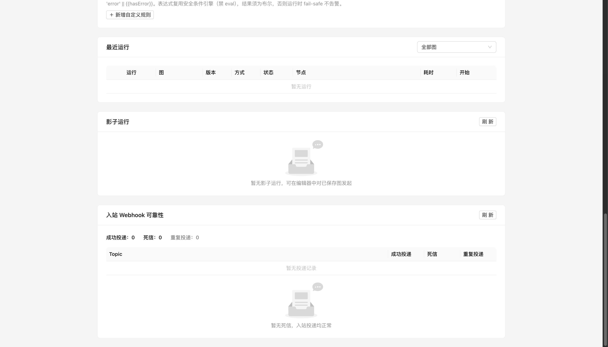
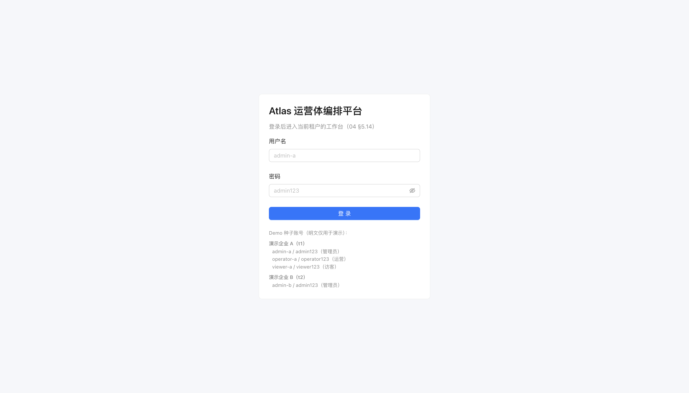

# 入站可靠性补强批契约设计

> **立项**：2026-09-23（承接「不用管 git，你推任务」总授权；批选由 AI 判断）。
>
> **定位**：[docs/39](39-入站Webhook批契约设计.md) 落了首个公开入站触发口，但可靠性留三个口子：①幂等环**仅进程内**（重启即失，Shopify 重试在重启窗口内会重复触发图）；②无发布版本/触发失败的事件只打 warning 日志后**永久丢失**（无死信、无重放）；③投递只有审计散点，**无可读的投递指标**。本批在 channels/iam/observability 之上补：去重记录 PG 化（两档）、死信捕获＋一键重放、投递计数指标。**零新依赖、零外部资源、无选型变更（不新增 ADR）**；**D24 再次部分取回、不解除**（自动重试调度/DLQ 定时扫描/外部告警出口仍缓做）。
>
> **形状权威**：本文；01–08 规格冲突时以规格为准。
>
> **边界**：不做自动/定时重放与重试调度（依赖 Shopify 自身投递重试＋人工重放）；不做投递成功率长保留时序（指标实时聚合自投递表）；不改公开入口状态码契约（docs/39 §C 原样）。

## 1. 范围

### A. 投递记录与去重存储（新 `src/atlas/channels/deliveries.py`）

- `DeliveryRecord`（dataclass，内部）：`tenant_id, webhook_id, binding_id, topic, shop, status, reasons, payload, duplicates, created_at, updated_at, replayed_at`。
  - `status: "received" | "dead"`：received＝至少一条订阅成功触发图；dead＝topic 有启用订阅但**所有**订阅均未触发（resolve 无版本/resolve 异常/trigger 异常）。
  - `reasons: list[{graphId, code}]`，code ∈ `NO_PUBLISHED_VERSION` / `RESOLVE_FAILED` / `TRIGGER_FAILED` / `MISSING_GRAPH_ID`。
  - `payload`：仅 dead 行存 envelope.data（订单/退款对象 JSON，供重放重建事件）；received/正常行**不存 payload**。
  - `duplicates: int`：同一 webhook id 后续命中次数（冲突时自增，含 Shopify 重试）。
- `DeliveryStore`（Protocol/基类）：
  - `check_and_record(tenant_id, *, webhook_id, binding_id, topic, shop) -> bool`：已存在 → True 并 `duplicates += 1, updated_at`；不存在 → 插入 received 占位行（无 payload）返回 False。
  - `mark_dead(tenant_id, webhook_id, *, reasons, payload)`：行转 dead、写 reasons/payload、更新 updated_at。
  - `mark_received(tenant_id, webhook_id)`：占位行确认 received（updated_at）。
  - `list_dead(tenant_id, *, topic=None, binding_id=None, limit=100) -> list[dict]`：倒序，limit clamp 1–100；投影**不含 payload**。
  - `get(tenant_id, webhook_id) -> DeliveryRecord | None`（重放取 payload，内部用）。
  - `mark_replayed(tenant_id, webhook_id, *, received: bool, reasons=None)`：写 replayed_at；received=True → 行转 received 且**清空 payload**；False → 更新 reasons、payload 保留。
  - `delete(tenant_id, webhook_id) -> bool`。
  - `metrics(tenant_id) -> dict`：`{byTopic: {topic: {received, dead, duplicates}}, totals: {...}}`，全量实时聚合。
- 内存实现 `InMemoryDeliveryStore`：dict 保序、单锁（demo/测试档；不设容量上限，reset 清空）。
- PG 实现：见 §D。
- **与进程内环的关系**：进程内 `_IdempotencyRing` 保留为**未注入 store 时的默认兜底**（内核单测零改动）；API 实际接线一律注入 store，去重以 store 为准（PG 档跨重启/多实例）。

### B. Deliverer 改造（`src/atlas/channels/webhooks.py`）

- 构造新增可选 `delivery_store`、`tenant_id` 不再静态：`deliver(...)` 内按当前 tenant 用 store。
- 流程：
  1. store 存在：`check_and_record` 命中 → `{duplicate:true}`（不再写审计，与现环语义一致）；未命中继续。
  2. 审计 `channel.webhook_received:{topic}`（原样）。
  3. 无启用订阅/unsupported topic → `{ignored:true}`；**占位行不留**（ignored 投递不写表）——故 check_and_record 的插入时机调整为「确认非 ignored 后」（接口仍由 deliverer 驱动：`record_if_new` 两步语义；实现可在 store 上用 `seen` + `commit_new` 两方法，落码以本语义为准）。
  4. 逐订阅 resolve/trigger，收集每 graph 的 outcome；全部失败 → `mark_dead(reasons, payload=envelope.data)`，仍返回 `{received:true}`（**公开入口契约不变**，Shopify 不因死信重试无意义；死信由站内可见可重放）；≥1 成功 → `mark_received`。
  5. 任何 store 异常只 warning，不阻断投递（fail-safe 退回仅日志）。
- `replay(tenant_id, binding, webhook_id)`：新方法——取 dead 记录（无 → None），以存储 payload 重建 `WebhookEnvelope`（topic/shop 取记录，data 取 payload，triggered_at=None），**绕过去重检查**重走订阅投递（binding 当前订阅为准；binding 已删/无订阅 → `{ignored:true}` 且不改状态）；成功 → `mark_replayed(received=True)`，仍全失败 → `mark_replayed(received=False, reasons)`；返回 `{webhookId, status, reasons}`。

### C. REST

| 方法/路径 | 鉴权 | 说明 |
|---|---|---|
| `GET /api/channels/webhooks/dead-letters` | read | `{items:[{webhookId,bindingId,topic,shop,reasons,createdAt,replayedAt}]}`；query `topic, bindingId, limit(≤100)` |
| `POST /api/channels/webhooks/dead-letters/{webhook_id}/replay` | operate | 重放；200 `{webhookId,status,reasons}`；非 dead/不存在 → 404；成功状态 `received`、仍失败 `dead`、当前无订阅 `ignored` |
| `DELETE /api/channels/webhooks/dead-letters/{webhook_id}` | administer | 删除投递行（operator/viewer 403）；200 `{deleted:true}`；不存在 404 |
| `GET /api/channels/webhooks/metrics` | read | `{byTopic, totals}`（全量实时，无窗口参数） |

- 路由与既有 `/api/channels/{binding_id}/webhooks` 前缀不冲突；公开入口 `/api/channels/hooks/...` 零改动。
- 重放/删除写操作经既有写操作审计中间件（path 模板自动落审计）。

### D. PG 持久化（迁移 017）

- `db/migrations/017_webhook_deliveries.sql`：
  ```sql
  CREATE TABLE IF NOT EXISTS webhook_deliveries (
      tenant_id   TEXT NOT NULL,
      webhook_id  TEXT NOT NULL,
      binding_id  TEXT NOT NULL,
      topic       TEXT NOT NULL,
      shop        TEXT NOT NULL,
      status      TEXT NOT NULL,
      reasons     JSONB NOT NULL DEFAULT '[]'::jsonb,
      payload     JSONB,                       -- 仅 dead 行；received 恒 NULL
      duplicates  INTEGER NOT NULL DEFAULT 0,
      created_at  TEXT NOT NULL,
      updated_at  TEXT NOT NULL,
      replayed_at TEXT,
      PRIMARY KEY (tenant_id, webhook_id)
  );
  CREATE INDEX IF NOT EXISTS idx_webhook_deliveries_tenant_status
      ON webhook_deliveries (tenant_id, status, created_at);
  ```
- `PgDeliveryStore`：裸 SQL（对齐 channels/pg.py 风格；`ON CONFLICT (tenant_id, webhook_id) DO UPDATE` 做 duplicates 自增；upsert payload 用 `CAST(:p AS jsonb)`，received 路径 payload 写 NULL）；行映射 reasons/payload JSON。
- 装配：TenantServices 两档新增 `webhook_deliveries`（内存 `InMemoryDeliveryStore` / PG `PgDeliveryStore`）；**reset 不清**（与连接/绑定/审计同类：运行可靠性记录）；迁移运行器自动识别 017。
- PG 集成测试 +4：017 去重/重复计数往返、dead 写/重放清空 payload、租户隔离、reset 不清。

### E. 前端（Monitoring 页加卡，不新增页面）

- 新组件 `components/monitoring/WebhookReliabilityCard.tsx`：
  - 顶部 metrics：总体 received/dead/duplicates 三个 Statistic＋按 topic 小表；
  - 死信表：webhookId（可截断）、topic Tag、shop、reasons 中文映射 Tooltip、createdAt、replayedAt、操作：`重放`（operate 可见）→ confirm → POST replay，结果 message 提示；`删除`（admin）Popconfirm；
  - 挂载加载 dead-letters＋metrics；viewer 无操作列。
- apiClient：`listWebhookDeadLetters / replayWebhookDeadLetter / deleteWebhookDeadLetter / getWebhookMetrics` ＋类型；+2 vitest。
- i18n：monitoring namespace 增 `webhookReliability` 段（标题/指标名/列/原因码映射/重放结果/删除；zh 填实、en-US 保持 `{}`）。

## 2. 非目标（写入 docs/14 D24 注记）

- 自动重试调度、定时扫描死信、退避队列（Shopify 自身重试＋人工重放）；
- 死信/指标长保留时序与 Prometheus 投递成功率指标（metrics 实时聚合；/metrics 导出不扩）；
- 外部告警出口（死信产生不发邮件/IM）、多订阅部分失败的逐条死信（v1 仅全失败才 dead）；
- Amazon/IM/短信入站、通用 JSON 签名口、Shopify 侧 webhook 注册 API（docs/39 既定缓做）。

## 3. Schema 契约（03 同步）

- 03 新增 `webhook_delivery` 契约：DeliveryRecord 字段、status/reasons code 集、dead-letter 投影、metrics 响应形状（正文权威在本文）。
- docs/39 公开入口三态/状态码契约不变；补一句「死信不改变 HTTP 响应，dead 仍回 received」。

## 4. 运行时语义

- Deliverer 线程内 store 按 tenant 显式调用，无上下文变量；store 调用全 fail-safe。
- 重放不经过公开入口、不需 HMAC（站内 operate），事件形状与原始投递一致（payload 来自验签后入库的原始 data）。
- 死信重放触发的图运行与普通 webhook 运行同构（mode="webhook"、经 Router 钉当前发布版本）。

## 5. 测试矩阵（13 同步，候选 U370 起）

| 文件 | 候选数 | 覆盖 |
|---|---|---|
| tests/test_channels_webhook_deliveries.py | ~12 | 内存 store：check/重复计数、ignored 不留行、全失败 dead+payload、部分成功 received、replay 成功清 payload/仍失败/无订阅 ignored/非 dead 404 语义、store 异常 fail-safe |
| tests/test_api_webhook_reliability.py | ~8 | dead-letters 列表/过滤/角色（viewer 可读、operator 重放、删除 administer）、重放 200 状态、重放后触发图、metrics 计数口径、404 |
| tests/test_channel_bindings_pg_integration.py | +4 | 017 往返/计数、dead/replay、隔离、reset 不清 |
| 前端 apiClient | +2 | list/replay/delete/metrics URL 与方法 |

立项基线（只许增测）：后端 **1252 passed/44 skipped**、前端 **579 passed/2 skipped/45 files**。

## 7. 落码收口（2026-09-23）

六个原子全部落完，实际测试数：

- 内核 `tests/test_channels_webhook_deliveries.py`：**16**（含参数化 4 例）；
- API `tests/test_api_webhook_reliability.py`：**8**；
- PG 集成 `tests/test_channel_bindings_pg_integration.py` 新增 **4**（整文件 12，ATLAS_RUN_INTEGRATION=1）；
- 前端 apiClient +**2**（前端总计 581 passed/2 skipped）；
- 全后端门：**1276 passed/48 skipped**。

一处与立项语义的细化：ignored 投递不留行（docs/40 §1B.3），故 docs/39 期遗留的「ignored 重试判 duplicate」回归断言改为「重复 ignored」——跨重启去重只对 received/dead 投递生效。

真实 HTTP 冒烟（内存档、uvicorn :8000）：建 OAuth 连接＋Shopify 绑定＋订阅未发布图 → 签名 POST `/api/channels/hooks/shopify/ch-1`（`X-Shopify-Hmac-SHA256` 合法）回 `{"received":true}`，监控页出现死信（原因：图无已发布版本）：



发布图并经 rollout start/promote 放量到 full 后，`POST /api/channels/webhooks/dead-letters/wh-smoke-40-1/replay` 返回 `{"status":"received"}`，死信消失、指标变为「成功投递 1」：


无死信时空态：



**结论：批次目标全部达成**——跨重启/多实例去重、死信捕获＋一键重放、投递指标可视；D24 未关闭部分（自动重试、定时扫描、外部告警出口、IM/短信入站）保持缓做。

## 6. 原子序

1. docs-only 立项：docs/40＋00/03/12/13/14/08＋handoff＋CHANGELOG（本步）。
2. `feat(channels): add webhook delivery store and dead-letter capture`（deliveries.py＋webhooks.py 改造＋内核测试）。
3. `feat(storage): add webhook deliveries migration and pg store`（017＋PgDeliveryStore＋集成 +4＋TenantServices 接线）。
4. `feat(api): add dead-letter replay and delivery metrics endpoints`（API 测试；deliverer 注入 store）。
5. `feat(frontend): add webhook reliability card on monitoring`（apiClient＋组件＋i18n＋测试）。
6. docs 收口：真实 HTTP 死信→重放冒烟（≥3 截图）＋CHANGELOG＋handoff/08/40 落码注记。

每代码原子后跑对应门；后端 `.venv/bin/pytest`，前端 `cd frontend && pnpm lint && pnpm test && pnpm build`。
